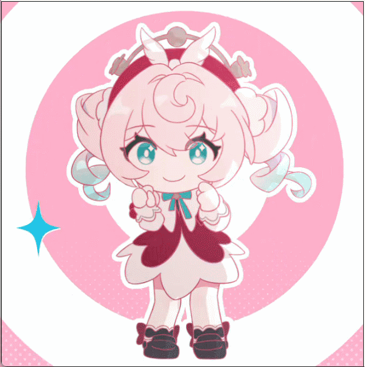

# **
Loch's Personal Homepage
**

**
👋👋👋Welcome to my personal homepage!😊❤️❤️
**

*
Here you can find information about me, my projects, and my interests.
*

    

## About Me

**I am a green hand and a passionate learner in the computer programming field. I enjoy exploring new technologies and improving my skills in all technical stacks.**

**In recent stage I have been focusing on learning web development, Machine Learning and CG.**

## Interests

**In my free time, I enjoy exploring new technologies, and writing technical articles. I'm always eager to learn and grow as a developer.**

## Contact

**Feel free to reach out to me via [lochwc669@gmail.com](mailto:lochwc669@gmail.com).**

## My Tech Stack
  

     

  

  

  

  

## My GitHub Stats

---

**
🙏🙏🙏Thank you for visiting my personal homepage!🙏🙏🙏
**
